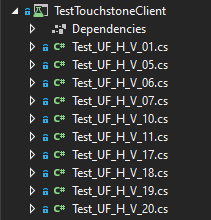

# Touchstone MedCom sent Client demo 

1) Open the project in [Visual studio](https://visualstudio.microsoft.com/)
2) Add your [Touchstone USER_KEY](https://touchstone.aegis.net/touchstone/userguide/html/client-testing/matching.html?highlight=user_key#execution-matching) to `touchstone-client-demo-dotnet\touchstone-client-demo-dotnet\Program.cs line 24` and `touchstone-client-demo-dotnet\TouchstoneClient\TouchstoneClientSent.cs line 22`
* Run one of the [MedCom Touchstone test Flows](https://github.com/hl7dk/dk-medcom/blob/master/doc/message/common/Touchstone%20User%20Flows.xlsx?raw=true) for HospitalNotification in
the XUnit project `TestTouchstoneClient`   
or
* Run the simple patient create program in the `touchstone-client-demo-dotnet` project e.g. against the [/FHIR4-0-1-Basic/P-R/Patient/Server Assigned Id/Patient-server-id-json](https://touchstone.aegis.net/touchstone/testscript?name=%2fFHIR4-0-1-Basic%2fP-R%2fPatient%2fServer+Assigned+Id%2fPatient-server-id-json)
Touchstone Test Script

